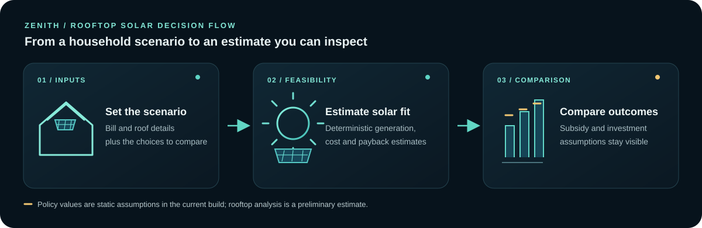

# Zenith

Zenith is a Next.js rooftop-solar decision-support application. The runnable application is in [`zenith-app`](./zenith-app/).

It provides:

- Solar feasibility and payback calculations
- Long-term investment projections
- Subsidy estimates with explicit policy caveats
- Gemini-assisted bill parsing, explanations, and preliminary rooftop analysis
- A protected dashboard and report-generation workflow

## How a planning decision moves



*This is an illustrative product flow. Results depend on entered values and policy assumptions; rooftop analysis is preliminary, not a structural or electrical survey.*

## Current launch position

The codebase is ready for a configured private beta, not yet a fully monetized public SaaS. It currently uses one environment-configured account, browser session storage for cross-module handoff, static subsidy assumptions, and no payment or installer-lead backend. Those boundaries are documented so they can be resolved before charging customers.

For setup, deployment, security controls, and the public-launch checklist, read [`zenith-app/README.md`](./zenith-app/README.md).

## Quick start

```bash
cd zenith-app
npm ci
Copy-Item .env.example .env.local   # PowerShell
npm run dev
```

Required environment variables are documented in `zenith-app/.env.example`. Never use default credentials in a deployed environment.
